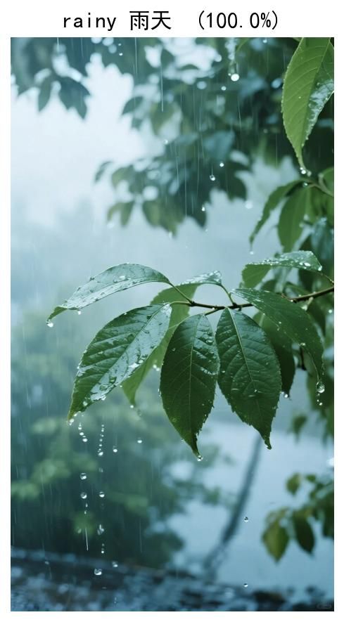
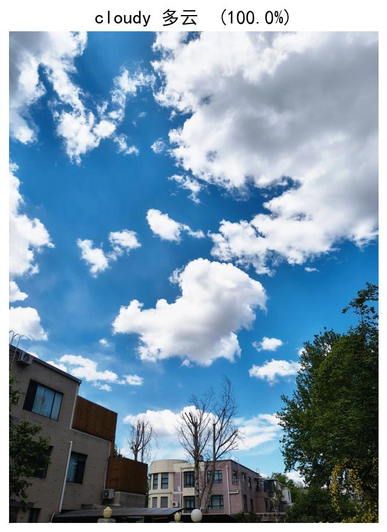
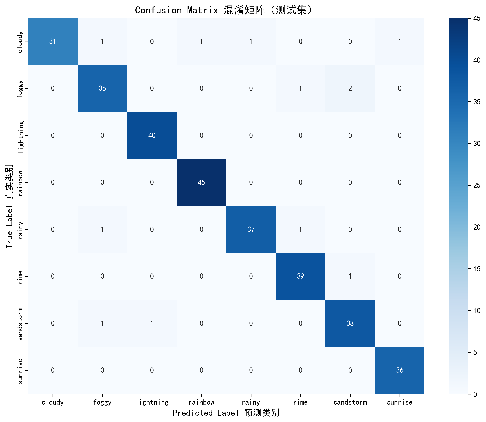
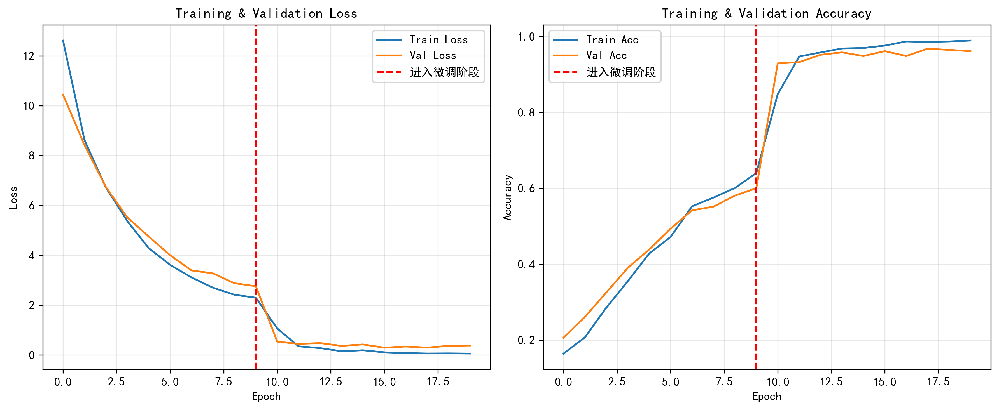

# 🌦️ Weather-ResNet：基于 ResNet 迁移学习的天气图像分类

[](https://github.com/sus96299-rgb/weather-resnet/actions/workflows/ci.yml)
[](https://opensource.org/licenses/MIT)
[](https://www.python.org/)

8 类天气图像识别（多云 / 雾 / 闪电 / 彩虹 / 雨 / 雾凇 / 沙尘暴 / 日出）。基于 ResNet18 的 ImageNet 预训练权重做两阶段迁移学习，**测试集准确率 96.18%**，支持单张推理与文件夹批量预测，并附「模型结构 × 数据增强」对照实验和手写 ResNet 实现。

---

## 📸 效果速览

对手机随手拍的真实照片直接推理（仓库自带训练好的权重，无需自己训练）：

<p>
  
  &nbsp;&nbsp;
  
</p>

**测试集混淆矩阵：准确率 96.18%（302/314）**，其中闪电、彩虹两类全部预测正确，主要误差集中在 foggy / sandstorm / cloudy 等视觉上本就重叠的类别。



**两阶段训练曲线**：红色虚线处从「冻结骨干训练分类头」切换到「解冻 Layer4 微调」，验证准确率随即从约 60% 跃升到 95% 以上。



---

## ✨ 项目亮点

- **两阶段迁移学习**：先冻结骨干只训分类头，再解冻 Layer4 微调，配合学习率调度，收敛快、泛化稳。
- **对照实验**：ResNet18 vs ResNet34、有数据增强 vs 无增强三组对比，量化每个因素的贡献。
- **场景化数据增强**：随机翻转 / 旋转 + ColorJitter 色彩扰动，模拟户外不同光照与大气散射条件。
- **完整工程闭环**：训练 → 最优权重保存 → 测试集评估（分类报告 + 混淆矩阵）→ 单图 / 批量推理落地。
- **手写 ResNet**：`src/resnet_manual.py` 从零实现 BasicBlock / Bottleneck 及 ResNet34/50/101、ResNeXt。
- **工程规范**：pytest 单元测试、Ruff 规范检查、GitHub Actions 多平台 CI、MIT 开源。

---

## 📁 项目结构

```
.
├── src/
│   ├── train.py                 # 主训练脚本（命令行参数）
│   ├── predict.py               # 推理：单张 / 文件夹批量
│   ├── ablation_experiment.py   # 三组对照实验（VSCode/PyCharm 分块运行）
│   └── resnet_manual.py         # 手写 ResNet34/50/101 + ResNeXt
├── tests/                       # pytest 单元测试（不依赖数据集 / GPU）
├── .github/workflows/ci.yml     # CI：Windows/Ubuntu × Python 3.10/3.12
├── checkpoints/
│   └── best_finetune.pth        # 训练好的 ResNet18 权重（可直接推理）
├── results/                     # 混淆矩阵、训练曲线、预测示例
├── class_indices.json           # 类别索引 ↔ 名称映射
├── requirements.txt             # 运行依赖
└── requirements-dev.txt         # 开发 / 测试依赖
```

> 数据集不入库（见 `.gitignore`），按下方「数据准备」获取。

---

## 🚀 快速开始

以下命令均在**项目根目录**执行。

```bash
# 1. 获取代码
git clone https://github.com/sus96299-rgb/weather-resnet.git
cd weather-resnet

# 2. 安装依赖（建议先建虚拟环境）
pip install -r requirements.txt
```

> GPU 用户请按 [PyTorch 官网](https://pytorch.org/get-started/locally/) 选择对应 CUDA 版本；无 GPU 也能推理，仅训练较慢。

### 直接体验推理（无需数据集、无需训练）

仓库已自带权重，clone 后即可运行：

```bash
# 单张图片：打印 Top-3 概率，并保存一张带标注的结果图
python src/predict.py --image results/demo_rainy.jpg

# 批量预测整个文件夹
python src/predict.py --image-dir D:/your_photos
```

### 自行训练

**第一步：准备数据。** 数据来自 Kaggle 公开数据集 `tamimresearch/weather-image-dataset`，组织成如下结构（`ablation_experiment.py` 开头的分块代码可用 kagglehub 自动下载并按 8:1:1 划分）：

```
weather/
├── train/{cloudy,foggy,lightning,rainbow,rainy,rime,sandstorm,sunrise}
├── val/   （同上 8 个类别文件夹）
└── test/  （同上 8 个类别文件夹）
```

**第二步：开始训练**（权重输出到 `checkpoints/`，曲线图输出到 `results/`）：

```bash
python src/train.py                   # 默认 ResNet18
python src/train.py --model resnet34  # 换 ResNet34
python src/train.py --epochs 20       # 调整训练轮数
```

### 运行测试

```bash
pip install -r requirements-dev.txt
pytest                  # 单元测试，无需数据集 / GPU，约 7 秒
ruff check src tests    # 代码规范检查
```

每次 push / Pull Request，GitHub Actions 会自动在 Windows、Ubuntu × Python 3.10/3.12 四个环境下跑上述检查。

---

## 🔬 技术方案

| 模块 | 做法 |
|---|---|
| 骨干网络 | ResNet18（ImageNet 预训练），替换最后的全连接层为 8 分类 |
| 训练策略 | 阶段一冻结骨干训分类头（lr=1e-3）→ 阶段二解冻 Layer4 + 分类头微调，StepLR 衰减 |
| 数据增强 | RandomHorizontalFlip、RandomRotation(15°)、ColorJitter、ImageNet 标准化 |
| 评估指标 | 准确率、per-class accuracy、classification_report、混淆矩阵 |
| 推理落地 | 单图 Top-K 概率 + 结果可视化；文件夹批量预测 |

`src/ablation_experiment.py` 以 `#%%` 分块组织，可在 VSCode / PyCharm 中逐块运行，复现「ResNet18+增强 / ResNet34+增强 / ResNet18 无增强」三组对比。

---

## 🤝 参与贡献

欢迎 Issue 和 PR！开发环境搭建、代码规范与提交流程见 [CONTRIBUTING.md](CONTRIBUTING.md)，参与者需遵守 [行为公约](CODE_OF_CONDUCT.md)，版本记录见 [CHANGELOG.md](CHANGELOG.md)。

## 📄 开源协议

基于 [MIT License](LICENSE) 开源，可自由使用、修改与分发，请保留原始版权声明。
